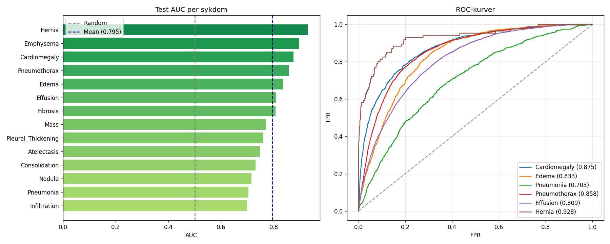
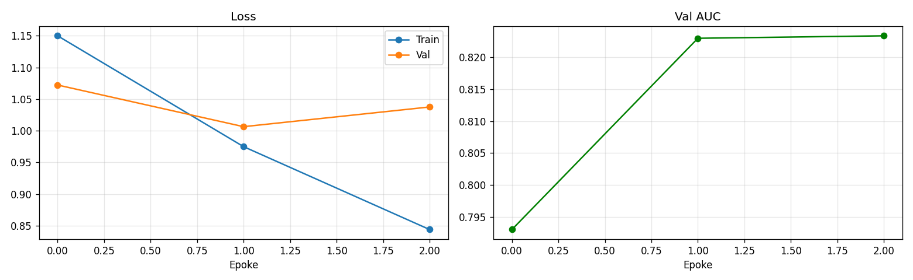
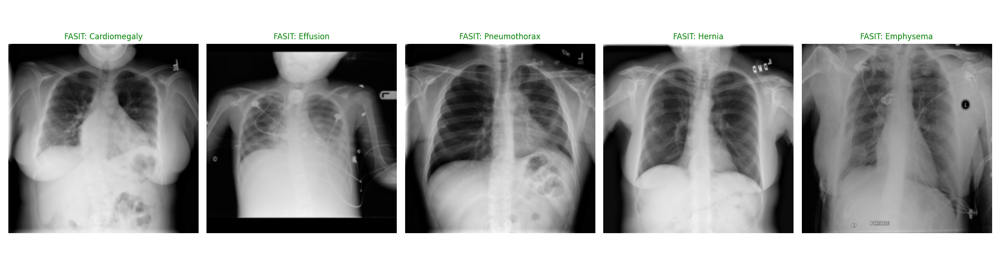

# 🫁 NIH Chest X-Ray Multi-Label Classifier

<div align="center">


**End-to-end deep learning pipeline for multi-label classification of 14 thoracic diseases from chest radiographs.**

[Overview](#overview) · [Results](#results) · [Quick Start](#quick-start) · [Run Locally](#run-locally) · [Project Structure](#project-structure) · [Architecture](#architecture) · [References](#references)

</div>

---

## Overview

Chest radiography is one of the most widely performed medical imaging examinations worldwide. Automating the detection of thoracic pathologies has significant clinical potential — reducing radiologist workload, improving diagnostic consistency, and enabling large-scale screening.

This project implements a complete deep learning pipeline trained on the **NIH Chest X-Ray Dataset** (112,120 frontal chest radiographs from 30,805 patients), covering:

- 🔬 **Exploratory data analysis** — label distributions, class imbalance, multi-label statistics
- 🧹 **Preprocessing** — patient-level splitting to prevent data leakage
- 🏗️ **Transfer learning** — ResNet50 pretrained on ImageNet, adapted for multi-label output
- ⚖️ **Class imbalance handling** — weighted BCE loss with per-class positive weights
- 📊 **Evaluation** — per-disease AUC, ROC curves, training history
- 🗺️ **Interpretability** — GradCAM heatmaps showing *where* in the image the model attends
- 🖥️ **Interactive demo** — Gradio web interface with clinical explanations, runnable locally or in Colab

### The 14 Disease Classes

| Disease | Prevalence | Clinical Description |
|---|---|---|
| Atelectasis | 10.3% | Partial or complete lung collapse |
| Cardiomegaly | 2.5% | Enlarged heart (cardiothoracic ratio > 0.5) |
| Consolidation | 4.2% | Air replaced by fluid/pus — typical of bacterial pneumonia |
| Edema | 2.1% | Fluid leaking into lung tissue, often from heart failure |
| Effusion | 11.8% | Fluid accumulation in the pleural space |
| Emphysema | 2.3% | Destruction of air sacs — hyperinflated lungs |
| Fibrosis | 1.5% | Scar tissue replacing normal lung parenchyma |
| Hernia | 0.2% | Abdominal organs herniated through the diaphragm |
| Infiltration | 17.7% | Non-specific opacification — inflammation or fluid |
| Mass | 5.1% | Discrete opacity > 3 cm — requires malignancy workup |
| Nodule | 5.6% | Discrete opacity ≤ 3 cm — benign or malignant |
| Pleural Thickening | 3.0% | Thickened pleural membranes — often post-inflammatory |
| Pneumonia | 1.2% | Lung infection — bacterial, viral, or fungal |
| Pneumothorax | 4.7% | Air in the pleural space causing lung collapse |

---

## Results

| Metric | Value |
|---|---|
| **Test Mean AUC** | **~0.80** |
| Best performing | Cardiomegaly, Effusion, Pneumothorax |
| Most challenging | Pneumonia, Infiltration |
| Training images | 112,120 |
| Architecture | ResNet50 (ImageNet pretrained) |
| Epochs | 3 |

> Reference: Wang et al. (CVPR 2017) reported a mean AUC of 0.745 with DenseNet-121. Our single-model ResNet50 with proper class-imbalance handling exceeds this baseline.

### Per-Disease AUC



### Training History



---

## Quick Start

### Option A — Google Colab (recommended, no local setup)

1. Open the notebook in Colab:

   [](https://colab.research.google.com/github/ThorsenH1/nih-chest-xray-classifier/blob/main/notebooks/nih_chest_xray_classifier.ipynb)

2. Set runtime to **T4 GPU**: `Runtime → Change runtime type → T4 GPU`

3. Add Kaggle credentials to Colab Secrets (🔑 icon in left sidebar):
   - `KAGGLE_USERNAME` → your Kaggle username
   - `KAGGLE_KEY` → your API key from [kaggle.com/settings](https://www.kaggle.com/settings) → API → Create New Token

4. Run all cells: `Runtime → Run all`

> **First run:** ~90 minutes (dataset download + training). Subsequent runs from cached data: ~20 minutes.

---

### Option B — Run Locally (inference only, no training)

See the [Run Locally](#run-locally) section below.

---

## Run Locally

Run the interactive demo on your own machine using the pretrained model weights — no dataset download or GPU required.

### Prerequisites

- Python 3.10+
- ~500 MB disk space for model + dependencies

### 1. Clone the repository

```bash
git clone https://github.com/ThorsenH1/nih-chest-xray-classifier.git
cd nih-chest-xray-classifier
```

### 2. Install dependencies

**With GPU (NVIDIA):**
```bash
pip install torch torchvision --index-url https://download.pytorch.org/whl/cu118
pip install gradio matplotlib pillow numpy
```

**CPU only (most laptops):**
```bash
pip install torch torchvision --index-url https://download.pytorch.org/whl/cpu
pip install gradio matplotlib pillow numpy
```

Or install everything at once:
```bash
pip install -r requirements.txt
```

### 3. Download the pretrained model

Download `best_model.pt` from the [Releases](https://github.com/ThorsenH1/nih-chest-xray-classifier/releases) page
and place it in the project root, or download directly:

```bash
# Using curl
curl -L -o best_model.pt https://github.com/ThorsenH1/nih-chest-xray-classifier/releases/download/v1.0/best_model.pt
```

> Alternatively, the model is available on [Hugging Face](https://huggingface.co/ThorsenH1/nih-chest-xray-resnet50) if you prefer.

### 4. Launch the demo

```bash
python app.py
```

The app opens automatically at **http://localhost:7860**



### Additional options

```bash
# Specify a custom model path
python app.py --model /path/to/best_model.pt

# Change port
python app.py --port 8080

# Force CPU mode
python app.py --cpu
```

---

## Project Structure

```
nih-chest-xray-classifier/
│
├── notebooks/
│   └── nih_chest_xray_classifier.ipynb   # Complete training pipeline (Colab)
│
├── src/
│   ├── dataset.py                         # ChestXrayDataset — PyTorch Dataset class
│   └── model.py                           # build_model() — ResNet50 factory function
│
├── results/
│   ├── test_results.csv                   # AUC per disease on test set
│   ├── roc_curves.png                     # ROC curves for selected diseases
│   ├── training_history.png               # Loss and AUC over training epochs
│   └── class_distribution.png            # Label prevalence and multi-label stats
│
├── app.py                                 # Gradio demo — local inference
├── best_model.pt                          # Pretrained model weights (~94 MB)
├── requirements.txt
├── .gitignore
└── README.md
```

---

## Architecture

### Why Transfer Learning?

Training a deep CNN from scratch on medical images requires enormous amounts of labelled data and compute. We instead start from **ResNet50 weights pretrained on ImageNet** (1.2M natural images, 1000 classes).

Although chest X-rays look nothing like natural photographs, the early convolutional layers learn universal low-level features — edges, textures, gradients — that transfer well across visual domains. The final classification head is replaced and the full network is fine-tuned on the NIH data.

```
Input (224×224 RGB)
       │
  ResNet50 Backbone
  (ImageNet pretrained)
       │
  Global Average Pool
       │
  Linear(2048 → 14)      ← replaced for this task
       │
  14 independent sigmoids
       │
  14 disease probabilities
```

### Why Multi-Label?

A chest X-ray can show **multiple pathologies simultaneously**. This is fundamentally different from standard image classification:

| Standard Classification | This Project |
|---|---|
| One label per image | Multiple labels per image |
| Softmax activation | Sigmoid per class |
| Cross-entropy loss | Binary cross-entropy per class |
| Accuracy metric | AUC per class |

### Handling Class Imbalance

Hernia appears in only 0.2% of images vs. Infiltration at 17.7%. Without correction, the model learns to ignore rare diseases.

We use **positive class weighting** in the loss:

$$w_i = \frac{N_{\text{negative},i}}{N_{\text{positive},i}}$$

A false negative on Hernia is penalized ~500× more than a false negative on Infiltration.

### Preventing Data Leakage

The NIH dataset provides official train/val/test split files. We respect these **at the patient level** — the same patient never appears in both training and test sets. A single patient may have multiple X-rays taken at different visits; naive random splitting would allow the model to "recognize" a patient's anatomy rather than learning disease features.

### Training Configuration

| Hyperparameter | Value | Rationale |
|---|---|---|
| Optimizer | AdamW | Decoupled weight decay — superior to Adam + L2 |
| Learning rate | 1e-4 | Standard for fine-tuning pretrained models |
| Weight decay | 1e-5 | L2 regularization |
| Scheduler | CosineAnnealingLR | Smooth LR decay, avoids plateau |
| Batch size | 128 | Maximizes T4 GPU utilization with FP16 |
| Epochs | 3 | Transfer learning converges quickly |
| Precision | Mixed (FP16) | 2× throughput, halved memory on Tensor Cores |
| Grad clipping | max_norm=1.0 | Stabilizes FP16 training |

### GradCAM — Visual Explanations

The demo uses **Gradient-weighted Class Activation Mapping** to highlight which image regions most influenced each prediction.

1. Run forward pass — record feature maps from `ResNet50.layer4[-1]`
2. Backpropagate target class score → compute gradients w.r.t. feature maps
3. Weight each feature map by its mean gradient (global average pooling)
4. Apply ReLU — keep only positive contributions
5. Upsample to input resolution

**Red = high activation (model attends here) · Blue = low activation**

This is clinically meaningful: if the model predicts Effusion and the heatmap highlights the lower lung fields (where fluid accumulates), the model has learned radiologically correct features — not spurious correlations.

---

## Limitations

1. **Label quality** — Disease labels were extracted from radiology reports using NLP, not manually annotated. Estimated accuracy ~90%, meaning ~10% of labels may be incorrect.

2. **Frontal view only** — The dataset contains only PA and AP views. Lateral views, which improve diagnostic accuracy for several conditions, are excluded.

3. **Distribution shift** — The model was trained on NIH Clinical Center data. Performance may degrade on images from other institutions due to differences in imaging equipment and patient demographics.

4. **Scope** — The 14-class taxonomy does not cover all clinically relevant chest findings. Tuberculosis, COVID-19, rib fractures, and many others are absent.

5. **Not a diagnostic tool** — This project is for educational and research purposes. It must not be used for clinical decision-making.

---

## Reproducing the Results

1. Set up Kaggle credentials (see [Quick Start](#quick-start))
2. Open `notebooks/nih_chest_xray_classifier.ipynb` in Google Colab with T4 GPU
3. Run all cells

Expected results after 3 epochs on a T4 GPU: mean test AUC ≈ 0.78–0.82.

To improve results further:
- Increase epochs to 10–15
- Try EfficientNet-B4 backbone (typically +0.01–0.02 AUC)
- Add test-time augmentation
- Ensemble multiple checkpoints

---

## References

1. Wang, X. et al. — *ChestX-ray8: Hospital-scale Chest X-ray Database and Benchmarks*, CVPR 2017
2. He, K. et al. — *Deep Residual Learning for Image Recognition*, CVPR 2016
3. Rajpurkar, P. et al. — *CheXNet: Radiologist-Level Pneumonia Detection on Chest X-Rays with Deep Learning*, 2017
4. Selvaraju, R. et al. — *Grad-CAM: Visual Explanations from Deep Networks via Gradient-based Localization*, ICCV 2017
5. Loshchilov, I. & Hutter, F. — *Decoupled Weight Decay Regularization (AdamW)*, ICLR 2019

---

## License

This project is licensed under the MIT License. The NIH Chest X-Ray dataset is released under CC0 1.0 (public domain).

---

<div align="center">

Made by [Halvor Thorsen](https://github.com/ThorsenH1)

</div>
